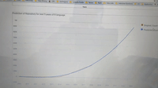

# Degree Analytics Coding Challenge

## Requirements:

Create a python flask/django API that shows a chart and data projection for the amount of Python and R Repos that will be created over the next 5 years on Github (use the github api for retrieving data)

## Setting up your local environment:

  Install virtualenv and pip before you proceed with the following steps:

    mkvirtualenv <name> # Create virtual environment
    lsvirtualenv # List the virtual environment

  In the activated python environment:

    pip install -r requirements.txt

  Run the script

    python app/main.py

  Run the test

    pytest

  Generate html test report

    pytest --html=report.html

